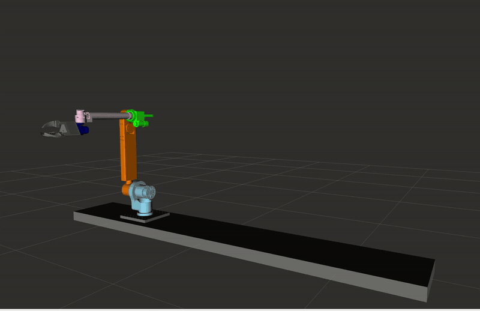
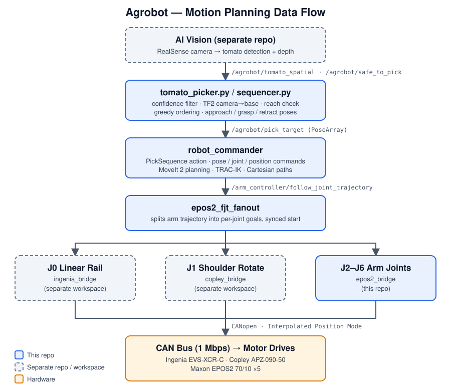

# Agrobot — Motion Planning

Motion-planning and motor-control software for **Agrobot (AgroBot TOM v2)**, the BU Robotics Club's autonomous tomato-picking robot, built for the MassRobotics Form & Function Challenge in the Spring 2026 semester. The robot is a 7-joint arm on a motorized **linear rail** (the rail is joint 0). Vision detects tomatoes, and this repository turns those detections into planned, executed arm motions: **ROS 2 Jazzy + MoveIt 2**, with CANopen motor bridges for the hardware.

**[▶ Watch the competition video](https://drive.google.com/file/d/175XPE-ufJtsahZAMrSigRacSJWQMvtdv/view?usp=sharing)** — Agrobot demo made for the MassRobotics Form & Function Challenge.

This repo covers the motion-planning side only. The AI vision pipeline, web dashboard, and the Copley/Ingenia drive bridges live in separate workspaces (see [Related systems](#related-systems)).



*The arm on its linear rail moving through MoveIt-planned poses in RViz.*

---

## Table of contents

1. [System overview](#1-system-overview)
2. [Repository layout](#2-repository-layout)
3. [Hardware](#3-hardware)
4. [Packages in detail](#4-packages-in-detail)
5. [Building](#5-building)
6. [Running the stack](#6-running-the-stack)
7. [Commanding the arm](#7-commanding-the-arm)
8. [Named poses](#8-named-poses)
9. [Related systems](#9-related-systems)
10. [Development history](#10-development-history)
11. [Notes](#11-notes)

---

## 1. System overview



A pick runs as: **approach → grasp → retract → drop in bin**, repeated for each tomato, with an optional confirmation step between tomatoes.

## 2. Repository layout

```
src/
├── robot_interfaces/        custom msgs / action / srv for commanding the arm
├── robot_commander/         commander node, tomato picker, sequencer, test programs
├── robot_description/       URDF/xacro model: rail, 6 arm links, gripper, meshes
├── moveit_config/           MoveIt 2 config: SRDF, kinematics, limits, controllers
├── robot_bringup/           launch files + ros2_control config for the real robot
├── epos2_bridge/            ROS 2 ↔ CANopen bridge for Maxon EPOS2 drives
├── epos2_bridge_interfaces/ MoveAbsolute / MoveAbsoluteTimed / MoveDelta services
└── ros2_canopen/            git submodule: CANopen stack (BU-Mass-Robotics-2026 fork)
scripts/                     CAN bring-up, EPOS2 startup, preflight, patch/verify helpers
```

Clone with submodules: `git clone --recurse-submodules <repo-url>`.

## 3. Hardware

All motors share one **CAN bus at 1 Mbps**, connected to the PC through a CANable2 USB adapter. Drives use **CANopen** and stream trajectories in **Interpolated Position Mode (IPM)**: the bridge slices a planned path into short position/velocity/time segments and the drive interpolates between them.

| Joint | Role | Drive | Bridge |
|---|---|---|---|
| J0 | Linear rail | Ingenia EVS-XCR-C | `ingenia_bridge` (separate workspace) |
| J1 | Shoulder rotate | Copley APZ-090-50 | `copley_bridge` (separate workspace) |
| J2–J6 | Shoulder pitch, elbow, wrist 1, wrist 2, wrist rotate | Maxon EPOS2 70/10 | `epos2_bridge` (this repo) |
| Gripper | Two-fin gripper | — | Modeled in the URDF with mimic joints |

Camera: Intel RealSense depth camera (vision pipeline is separate).

## 4. Packages in detail

### `robot_interfaces`

| Type | Name | Purpose |
|------|------|---------|
| msg | `JointCommand` | Target values for joints `j0`–`j6` |
| msg | `PoseCommand` | Named pose (a saved arm configuration) |
| msg | `PositionCommand` | `x y z roll pitch yaw` plus a `cartesian_path` flag |
| action | `PickSequence` | Goal: `PoseArray` of tomato targets. Result: success/message. Feedback: tomato index, total, current step, awaiting-confirmation flag |
| srv | `SetIndicator` | Indicator control |

### `robot_commander`

`src/commander.cpp` is the bridge between high-level commands and MoveIt.

- Subscribers: `/agrobot/pose_cmd` (named goal), `/agrobot/joint_cmd` (joint goal), `/agrobot/position_cmd` (Cartesian pose or Cartesian path), `/agrobot/proceed` (confirmation between picks).
- A `PickSequence` **action server** runs the main picking loop.
- `launch/commander.launch.py` starts the node.
- `src/tomato_picker.py` consumes vision detections: filters by confidence and already-picked IDs, transforms centroids camera → robot base frame with TF2, drops anything out of reach, sorts greedily along the rail axis (Y), and emits approach/grasp/retract poses per tomato. It is gated by `/agrobot/safe_to_pick`. Detailed inline notes in the file explain the pipeline.
- `src/sequencer.py` supports ordering/sequencing of picks.
- `src/tests/`: `named_goal`, `joint_goal`, `position_goal`, `cartesian_path` (C++), plus `test_button_server.py` and `test_multi_tomato.py`.

### `robot_description`

Xacro/URDF for the full robot: linear rail, links 1–6, joint 6 as a **revolute** wrist rotate, and the **gripper** (base link, fixed joint, fin links with mimic joints, `Gripper.stl` mesh). `launch/display.launch.xml` plus an RViz config let you inspect and jog the model.

### `moveit_config`

MoveIt 2 setup generated with the Setup Assistant and then customized:

- Planning group `arm` defined as a **kinematic chain** from `linear_rail_link` to `link6`; separate `gripper` group.
- **TRAC-IK** (`trac_ik_kinematics_plugin`) as the IK solver.
- Joint limits, `ros2_controllers.yaml`, `moveit_controllers.yaml`, initial positions, and Pilz Cartesian limits.
- Named group states (see below), including gripper open/closed.
- Functional interactive markers in RViz.

### `robot_bringup`

`launch/robot.launch.xml` starts `robot_state_publisher`, `ros2_control`, MoveIt, and RViz for the real robot; `launch/display.launch.xml` is a lightweight display for testing joint updates. RViz configs and the bringup `ros2_controllers.yaml` live in `config/`.

### `epos2_bridge` and `epos2_bridge_interfaces`

Translate ROS 2 trajectories into CANopen commands for the Maxon EPOS2 drives. These bridges were developed by other members of the team, not by the motion-planning author; the motion-planning side consumes them through the MoveIt controller configuration.

| Node | Role |
|---|---|
| `epos2_joint_bridge` | Generic per-joint bridge (configs in `config/joints/j2…j6.yaml`) |
| `epos2_j3_bridge` | Original J3 bridge with the full IPM implementation |
| `epos2_arm_controller` | Arm-level controller |
| `epos2_fjt_fanout` | Splits a full-arm `FollowJointTrajectory` goal into per-joint child goals, with synchronized start times |
| `pvt_reduce` | Reduces/coarsens position-velocity-time segment streams |

Services (`epos2_bridge_interfaces`): `MoveAbsolute`, `MoveAbsoluteTimed`, `MoveDelta`.

The safe production pattern is documented in `src/epos2_bridge/SAFE_EPOS2_BRIDGE_CHECKPOINT.md`: `FollowJointTrajectory` is the motion path, IPM is activated only after the FIFO is prefilled, completion uses a `dt=0` terminator then Position Mode hold, and mid-stream cancels terminate IPM the same way. Legacy hold-stream services are disabled by default.

### `scripts/`

| Script | Purpose |
|---|---|
| `ensure_can_interface.sh`, `can_bootstrap.env` | Bring up the CAN interface (settings via env file) |
| `start_epos2_arm.sh`, `start_epos2_system.sh` | Start the EPOS2 drivers and bridges |
| `j3_preflight.sh` | Pre-run checks for joint 3 |
| `start_full_motion_stack.sh` | Hardware stack → preflight → joint-state merger → arm controller → MoveIt |
| `merge_joint_states.py` | Merge per-joint state topics into `/joint_states` |
| `apply_ipm_pdo_remap*.sh`, `verify_epos2_j3_ipm.sh`, `test_epos2_bridge_services.sh` | PDO remapping, verification, and service tests |
| `patch_*.py`, `fix_*.py`, `coarsen_moveit_timed_mode.py` | One-off patch helpers used during hardware tuning |

Scripts assume a workspace at `~/agrobot_ws` and ROS 2 Jazzy at `/opt/ros/jazzy`.

## 5. Building

Requires ROS 2 Jazzy, MoveIt 2, and TRAC-IK.

```bash
git submodule update --init --recursive
cd ~/agrobot_ws                      # workspace containing this repo's src/
source /opt/ros/jazzy/setup.bash
colcon build
source install/setup.bash
```

## 6. Running the stack

```bash
# 1. CAN bus up at 1 Mbps (see scripts/ensure_can_interface.sh for the slcan path)
sudo ip link set can0 up type can bitrate 1000000

# 2. Full hardware + MoveIt stack
scripts/start_full_motion_stack.sh

# 3. Commander node
ros2 launch robot_commander commander.launch.py
```

For model/visualization only (no hardware): `ros2 launch robot_description display.launch.xml` or `ros2 launch robot_bringup display.launch.xml`.

## 7. Commanding the arm

```bash
# Named pose
ros2 topic pub --once /agrobot/pose_cmd robot_interfaces/msg/PoseCommand "{pose_name: 'attention'}"

# Joint goal
ros2 topic pub --once /agrobot/joint_cmd robot_interfaces/msg/JointCommand \
  "{j0: 0.0, j1: 0.0, j2: 0.0, j3: 0.0, j4: 0.0, j5: 0.0, j6: 0.0}"

# Cartesian pose (set cartesian_path: true for a straight-line path)
ros2 topic pub --once /agrobot/position_cmd robot_interfaces/msg/PositionCommand \
  "{x: 0.4, y: 0.0, z: 0.3, roll: 0.0, pitch: 0.0, yaw: 0.0, cartesian_path: false}"
```

Full pick runs use the `PickSequence` action with a `PoseArray` of targets; `/agrobot/proceed` confirms each step when the feedback reports `awaiting_confirm`.

## 8. Named poses

Defined in `moveit_config/config/robot.srdf`:

| Group | Name | Description |
|---|---|---|
| arm | `attention` | Home / rest |
| arm | `crouch` | Compact transport pose |
| arm | `vertical` | Arm upright |
| arm | `bin` | Drop-off position for picked tomatoes |
| gripper | `gripper_open`, `gripper_closed` | Gripper states |

## 9. Related systems

Not part of this repository:

- **AgrobotV2** — AI vision: SAM2 segmentation + DINOv2/SigLIP scoring + a small fusion network, publishing detections, 3D detections, and `/agrobot/safe_to_pick`.
- **Ingenia / Copley bridges** — drivers for J0 (rail) and J1, plus the trajectory fanout covering all joints.
- **Web dashboard** — browser UI (rosbridge) for monitoring and control.

## 10. Development history

Software work in this repo, grouped by area:

- **Interfaces & commander** — created `robot_interfaces`; built the commander node, `PickSequence` action server, topic namespace under `/agrobot`, and test programs.
- **Picker integration** — integrated the tomato-picking script with TF2 frame transforms, the safety gate, picked-ID tracking, and a placeholder camera transform.
- **Robot model** — new rail zero point and limits, real gripper model with mimic joints, joint 6 changed from fixed to revolute, link 5→6 offset (+10 mm), world-frame orientation fix, new and renamed named poses.
- **MoveIt** — KDL → TRAC-IK, kinematic-chain arm group, gripper groups, updated limits and controller configs, RViz interactive markers.
- **Motors** — the EPOS2 bridge and motor drivers were written by other team members; the motion-planning work here wired them into the MoveIt controller configuration. An earlier standalone J0 bringup package was removed once the EPOS2 bridge covered the motors.

## 11. Notes

- Many `*.bak_*` files and `.bak_*` directories in `epos2_bridge`, `moveit_config`, and `scripts` are snapshots from hardware debugging; they are not part of the working code path.
- `epos2_j3_bridge_WORKING.py` and `epos2_j3_bridge_clean.py` are reference variants kept for comparison.
- `scripts/can_bootstrap.env` contains machine-specific CAN adapter serial paths; update it for your adapter.
